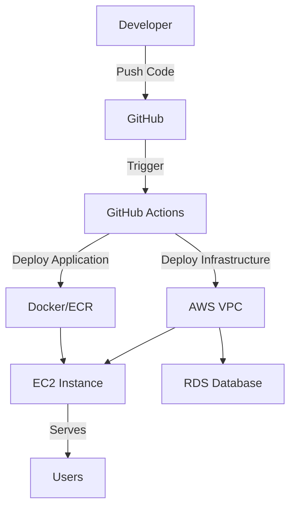

# 🚀 AWS Terraform Infrastructure

[](https://github.com/belayfitsum/aws-terraform-infrastructure/actions)
[](https://github.com/belayfitsum/aws-terraform-infrastructure/actions)


> **Production-ready infrastructure with automated CI/CD pipelines**  
> Deploy scalable Node.js applications to AWS with zero-downtime deployments

## 🏗️ Architecture Overview



## 🚀 Quick Start

> Get your infrastructure running in **5 minutes**!

### Prerequisites Checklist
- [ ] AWS Account with appropriate IAM permissions
- [ ] GitHub repository with Actions enabled
- [ ] Terraform >= 1.5.0 installed locally
- [ ] Node.js >= 20.0 for local development

### 1️⃣ Clone & Setup
```bash
git clone https://github.com/belayfitsum/aws-terraform-infrastructure.git
cd aws-terraform-infrastructure
```

### 2️⃣ Configure GitHub Secrets
Add these secrets to your GitHub repository:

| Secret Name | Description | Example |
|-------------|-------------|---------|
| `AWS_REGION` | AWS deployment region | `eu-central-1` |
| `AWS_ROLE` | IAM role ARN for OIDC | `arn:aws:iam::123:role/github-actions` |
| `DB_PASSWORD` | Database password | `SecurePassword123!` |
| `ECR_REPOSITORY` | ECR repository name | `my-app-repo` |

### 3️⃣ Deploy Infrastructure
```bash
# Manual deployment
cd environments/dev
terraform init
terraform plan
terraform apply

# OR use GitHub Actions (recommended)
# Push to main branch triggers automatic deployment
```

### 4️⃣ Deploy Application
```bash
# Local development
cd app
npm install
npm test
npm start

# Production deployment via GitHub Actions
git add .
git commit -m "Deploy application"
git push origin main
```

## 🔄 CI/CD Pipeline Flow

```
┌─────────────┐    ┌─────────────┐    ┌─────────────┐    ┌─────────────┐
│ Feature     │───▶│ Pull        │───▶│ Code        │───▶│ Production  │
│ Branch      │    │ Request     │    │ Review      │    │ Deployment  │
└─────────────┘    └─────────────┘    └─────────────┘    └─────────────┘
      │                    │                    │                    │
      ▼                    ▼                    ▼                    ▼
  Safe Dev            Tests Only          Human Gate           Auto Deploy
```

### Pipeline Triggers

| Event | Infrastructure Pipeline | Application Pipeline | Deployment |
|-------|-------------------------|---------------------|------------|
| **PR Created** | ✅ Plan Only | ✅ Test + Build | ❌ No Deploy |
| **PR Merged** | ✅ Apply Changes | ✅ Deploy to Prod | ✅ Live |
| **Manual Trigger** | ✅ Full Pipeline | ✅ Full Pipeline | ✅ On Demand |

## 🌍 Environment Configuration

| Environment | Instance Type | Database | Storage | Auto-Deploy | Purpose |
|-------------|---------------|----------|---------|-------------|----------|
| **Development** | `t2.micro` | `db.t3.micro` | 20GB | ✅ On PR | Testing |
| **Production** | `t3.medium` | `db.t3.small` | 100GB | ✅ On Merge | Live Users |

## 📁 Project Structure

```
aws-terraform-infrastructure/
├── 🚀 app/                     # Node.js Application
│   ├── app.js                  # Express API server
│   ├── db.js                   # Database connection
│   ├── Dockerfile              # Container configuration
│   ├── package.json            # Dependencies & scripts
│   └── app.test.js             # Unit tests
├── 🏗️ environments/            # Environment Configs
│   ├── dev/                    # Development settings
│   │   ├── main.tf             # Dev infrastructure
│   │   ├── variables.tf        # Dev variables
│   │   └── terraform.tfvars    # Dev values
│   └── prod/                   # Production settings
│       ├── main.tf             # Prod infrastructure
│       ├── variables.tf        # Prod variables
│       └── terraform.tfvars    # Prod values
├── 🧩 modules/                 # Reusable Components
│   ├── vpc/                    # Network infrastructure
│   ├── security/               # Security groups & rules
│   ├── compute/                # EC2 instances
│   └── database/               # RDS databases
└── ⚙️ .github/workflows/       # CI/CD Pipelines
    ├── infrastructure.yaml     # Infrastructure deployment
    ├── application.yaml        # Application CI/CD
    └── full-pipeline.yaml      # Combined deployment
```

## 🛠️ Infrastructure Modules

<details>
<summary><strong>🌐 VPC Module</strong></summary>

**Creates secure network foundation:**
- VPC with public/private subnets
- Internet Gateway for public access
- Route tables and security
- Multi-AZ setup for high availability

</details>

<details>
<summary><strong>🔒 Security Module</strong></summary>

**Implements security best practices:**
- EC2 security groups (SSH, HTTP/HTTPS)
- RDS security groups (database access)
- Least privilege access rules
- Environment-specific CIDR restrictions

</details>

<details>
<summary><strong>💻 Compute Module</strong></summary>

**Manages application servers:**
- Auto-scaling EC2 instances
- Environment-specific instance types
- EBS volume encryption
- CloudWatch monitoring

</details>

<details>
<summary><strong>🗄️ Database Module</strong></summary>

**Provides managed database services:**
- RDS PostgreSQL with encryption
- Automated backups and snapshots
- Multi-AZ deployment for production
- Performance monitoring

</details>

## 🔧 Advanced Usage

### Manual Infrastructure Deployment
```bash
# Initialize Terraform
cd environments/dev
terraform init

# Review planned changes
terraform plan

# Apply infrastructure
terraform apply

# View outputs
terraform output
```

### Local Application Development
```bash
# Install dependencies
cd app
npm install

# Run tests
npm test

# Start development server
npm run dev

# Build Docker image
docker build -t my-app .
```

### Environment Variables
```bash
# Application configuration
DB_HOST=your-rds-endpoint
DB_PORT=5432
DB_USER=postgres
DB_PASSWORD=your-secure-password
DB_NAME=your-database
PORT=3000
```

## 🚨 Troubleshooting

<details>
<summary><strong>Pipeline Failures</strong></summary>

**Common issues and solutions:**

- **Tests failing**: Check `npm test` output in Actions logs
- **Terraform errors**: Verify AWS credentials and permissions
- **Docker build fails**: Check Dockerfile syntax and dependencies
- **Deployment timeout**: Increase timeout in workflow or check EC2 connectivity

</details>

<details>
<summary><strong>Infrastructure Issues</strong></summary>

**Debugging infrastructure:**

```bash
# Check Terraform state
terraform show

# Validate configuration
terraform validate

# Debug with detailed logs
TF_LOG=DEBUG terraform apply
```

</details>

## 🤝 Contributing

1. **Fork** the repository
2. **Create** a feature branch (`git checkout -b feature/amazing-feature`)
3. **Commit** your changes (`git commit -m 'Add amazing feature'`)
4. **Push** to the branch (`git push origin feature/amazing-feature`)
5. **Open** a Pull Request
