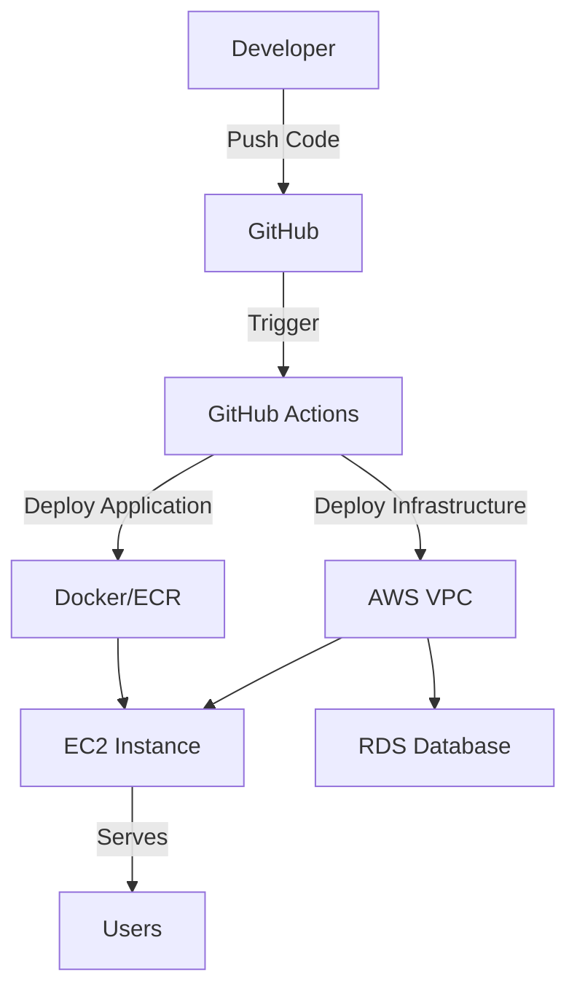

# 🚀 AWS Terraform Infrastructure

[](https://github.com/belayfitsum/aws-terraform-infrastructure/actions)
[](https://github.com/belayfitsum/aws-terraform-infrastructure/actions)


> **Production-ready infrastructure with automated CI/CD pipelines**  
> Deploy scalable Node.js applications to AWS with zero-downtime deployments

## 🏗️ Architecture Overview



## 🚀 Quick Start

> Get your infrastructure running in **5 minutes**!

### Prerequisites Checklist
- [ ] AWS Account with appropriate IAM permissions
- [ ] GitHub repository with Actions enabled
- [ ] Terraform >= 1.5.0 installed locally
- [ ] Node.js >= 20.0 for local development

### 1️⃣ Clone & Setup
```bash
git clone https://github.com/belayfitsum/aws-terraform-infrastructure.git
cd aws-terraform-infrastructure
```

### 2️⃣ Configure GitHub Secrets
Add these secrets to your GitHub repository:

| Secret Name | Description | Example |
|-------------|-------------|---------|
| `AWS_REGION` | AWS deployment region | `<your-region>` |
| `AWS_ACCESS_KEY_ID` | AWS access key | `<your-access-key>` |
| `AWS_SECRET_ACCESS_KEY` | AWS secret key | `<your-secret-key>` |
| `ECR_REPOSITORY` | ECR repository name | `<your-repo-name>` |

### 3️⃣ Deploy Infrastructure
```bash
# Manual deployment
cd environments/dev
terraform init
terraform plan
terraform apply

# OR use GitHub Actions (recommended)
# Push to main branch triggers automatic deployment
```

### 4️⃣ Deploy Application
```bash
# Local development
cd app
npm install
npm test
npm start

# Production deployment via GitHub Actions
git add .
git commit -m "Deploy application"
git push origin main
```

## 🔄 CI/CD Pipeline Flow

```
┌─────────────┐    ┌─────────────┐    ┌─────────────┐    ┌─────────────┐
│ Feature     │───▶│ Pull        │───▶│ Code        │───▶│ Production  │
│ Branch      │    │ Request     │    │ Review      │    │ Deployment  │
└─────────────┘    └─────────────┘    └─────────────┘    └─────────────┘
      │                    │                    │                    │
      ▼                    ▼                    ▼                    ▼
  Safe Dev            Tests Only          Human Gate           Auto Deploy
```

### Pipeline Triggers

| Event | Infrastructure Pipeline | Application Pipeline | Deployment |
|-------|-------------------------|---------------------|------------|
| **PR Created** | ✅ Plan Only | ✅ Test + Build | ❌ No Deploy |
| **PR Merged** | ✅ Apply Changes | ✅ Deploy to Prod | ✅ Live |
| **Manual Trigger** | ✅ Full Pipeline | ✅ Full Pipeline | ✅ On Demand |

## 🌍 Environment Configuration

| Environment | Instance Type | Database | Storage | Auto-Deploy | Purpose |
|-------------|---------------|----------|---------|-------------|----------|
| **Development** | `t2.micro` | `db.t3.micro` | 20GB | ✅ On PR | Testing |
| **Production** | `t3.medium` | `db.t3.small` | 100GB | ✅ On Merge | Live Users |

## 📁 Project Structure

```
aws-terraform-infrastructure/
├── 🚀 app/                     # Node.js Application
│   ├── app.js                  # Express API server
│   ├── db.js                   # Database connection
│   ├── Dockerfile              # Container configuration
│   ├── package.json            # Dependencies & scripts
│   └── app.test.js             # Unit tests
├── 🏗️ environments/            # Environment Configs
│   ├── dev/                    # Development settings
│   │   ├── main.tf             # Dev infrastructure
│   │   ├── variables.tf        # Dev variables
│   │   └── terraform.tfvars    # Dev values
│   └── prod/                   # Production settings
│       ├── main.tf             # Prod infrastructure
│       ├── variables.tf        # Prod variables
│       └── terraform.tfvars    # Prod values
├── 🧩 modules/                 # Reusable Components
│   ├── vpc/                    # Network infrastructure
│   ├── security/               # Security groups & rules
│   ├── compute/                # EC2 instances
│   └── database/               # RDS databases
└── ⚙️ .github/workflows/       # CI/CD Pipelines
    ├── infrastructure.yaml     # Infrastructure deployment
    ├── application.yaml        # Application CI/CD
    └── full-pipeline.yaml      # Combined deployment
```

## 🛠️ Infrastructure Modules

<details>
<summary><strong>🌐 VPC Module</strong></summary>

**Creates secure network foundation:**
- VPC with public/private subnets
- Internet Gateway for public access
- Route tables and security
- Multi-AZ setup for high availability

</details>

<details>
<summary><strong>🔒 Security Module</strong></summary>

**Implements security best practices:**
- EC2 security groups (SSH, HTTP/HTTPS)
- RDS security groups (database access)
- Least privilege access rules
- Environment-specific CIDR restrictions

</details>

<details>
<summary><strong>💻 Compute Module</strong></summary>

**Manages application servers:**
- Auto-scaling EC2 instances
- Environment-specific instance types
- EBS volume encryption
- CloudWatch monitoring

</details>

<details>
<summary><strong>🗄️ Database Module</strong></summary>

**Provides managed database services:**
- RDS PostgreSQL with encryption
- Automated backups and snapshots
- Multi-AZ deployment for production
- Performance monitoring

</details>

## 🔧 Advanced Usage

### Manual Infrastructure Deployment
```bash
# Initialize Terraform
cd environments/dev
terraform init

# Review planned changes
terraform plan

# Apply infrastructure
terraform apply

# View outputs
terraform output
```

### Local Application Development
```bash
# Install dependencies
cd app
npm install

# Run tests
npm test

# Start development server
npm run dev

# Build Docker image
docker build -t my-app .
```

### Environment Variables
```bash
# Application configuration
DB_HOST=your-rds-endpoint
DB_PORT=5432
DB_USER=postgres
DB_PASSWORD=your-secure-password
DB_NAME=your-database
PORT=3000
```

## 🛡️ Security & Vulnerability Management

### Automated Security Scanning
This project includes comprehensive security scanning with **Trivy** integrated into the CI/CD pipeline:

- **Container vulnerability scanning** on every build
- **Dependency vulnerability detection** for Node.js packages
- **SARIF report generation** for GitHub Security integration
- **Automated security alerts** in GitHub Security tab

### GitHub Secrets Configuration
Add these additional secrets for full functionality:

| Secret Name | Description | Required For |
|-------------|-------------|-------------|
| `AWS_ACCESS_KEY_ID` | AWS access key | ECR/Deployment |
| `AWS_SECRET_ACCESS_KEY` | AWS secret key | ECR/Deployment |
| `AWS_SSH_PRIVATE_KEY` | EC2 SSH private key | Deployment |
| `AWS_EC2_HOST` | EC2 instance IP | Deployment |

### Security Scanning Commands

#### Local Trivy Scanning
```bash
# Install Trivy
curl -sfL https://raw.githubusercontent.com/aquasecurity/trivy/main/contrib/install.sh | sh -s -- -b /usr/local/bin

# Login to ECR
aws ecr get-login-password --region <your-region> | docker login --username AWS --password-stdin <account-id>.dkr.ecr.<your-region>.amazonaws.com

# Scan ECR image
trivy image <account-id>.dkr.ecr.<your-region>.amazonaws.com/<your-repo>:latest

# Generate HTML report
trivy image --format template --template '@contrib/html.tpl' -o report.html <account-id>.dkr.ecr.<your-region>.amazonaws.com/<your-repo>:latest

# Generate JSON report
trivy image --format json -o report.json <account-id>.dkr.ecr.<your-region>.amazonaws.com/<your-repo>:latest
```

#### Dependency Management
```bash
# Create package-lock.json
cd app
npm i --package-lock-only

# Fix vulnerabilities
npm audit fix

# Check for updates
npm update

# Security audit
npm audit --audit-level=moderate
```

### Viewing Security Results

1. **GitHub Security Tab**
   - Navigate to repository → **Security** → **Code scanning alerts**
   - View detailed vulnerability information
   - Get remediation suggestions
   - Track vulnerability status over time

2. **GitHub Actions Artifacts**
   - Download SARIF files from completed pipeline runs
   - Access detailed scan reports
   - Compare results across builds

3. **Local Terminal Output**
   - Real-time vulnerability table display
   - Severity-based categorization
   - Direct remediation guidance

### Common Vulnerabilities & Fixes

#### High Severity: CVE-2024-21538 (cross-spawn)
```bash
# Problem: cross-spawn 7.0.3 has ReDoS vulnerability
# Solution: Update to 7.0.5+
npm update cross-spawn
# Or force update in package-lock.json
```

#### Dependency Update Workflow
```bash
# 1. Update dependencies locally
cd app
npm audit fix
npm update

# 2. Test changes
npm test

# 3. Commit and push
git add app/package*.json
git commit -m "Security: Update dependencies to fix vulnerabilities"
git push

# 4. Monitor new scan results in GitHub Security tab
```

### Security Pipeline Configuration

The security scanning is configured in `.github/workflows/application.yaml`:

```yaml
# Trivy vulnerability scanner
- name: Run Trivy vulnerability scanner
  uses: aquasecurity/trivy-action@master
  with:
    image-ref: ${{ steps.login-ecr.outputs.registry }}/${{ env.ECR_REPOSITORY }}:${{ steps.build.outputs.image-tag }}
    format: 'sarif'
    output: 'trivy-results.sarif'
  continue-on-error: true

# Upload to GitHub Security
- name: Upload Trivy results to GitHub Security
  uses: github/codeql-action/upload-sarif@v3
  if: always()
  with:
    sarif_file: trivy-results.sarif
```

### Required Permissions
Ensure your workflow has these permissions:
```yaml
permissions:
  security-events: write  # Required for SARIF upload
  contents: read
  pull-requests: write
```

## 🚨 Troubleshooting

<details>
<summary><strong>Pipeline Failures</strong></summary>

**Common issues and solutions:**

- **Tests failing**: Check `npm test` output in Actions logs
- **Terraform errors**: Verify AWS credentials and permissions
- **Docker build fails**: Check Dockerfile syntax and dependencies
- **Deployment timeout**: Increase timeout in workflow or check EC2 connectivity

</details>

<details>
<summary><strong>Infrastructure Issues</strong></summary>

**Debugging infrastructure:**

```bash
# Check Terraform state
terraform show

# Validate configuration
terraform validate

# Debug with detailed logs
TF_LOG=DEBUG terraform apply
```

</details>

## 🚀 Deployment Status & Testing

### Current Status ✅
- **Infrastructure**: Deployed and running
- **CI/CD Pipeline**: Fully operational
- **Security Scanning**: Active with Trivy integration
- **EC2 Deployment**: Configured and accessible
- **Application**: Ready for deployment

### Live Application
- **EC2 Instance**: `<instance-id>` (running)
- **Public IP**: `<your-ec2-ip>`
- **Application URL**: http://<your-ec2-ip>:3000
- **Health Check**: http://<your-ec2-ip>:3000/health

### Testing the Deployment

#### Quick Health Check
```bash
# Test application endpoint
curl http://<your-ec2-ip>:3000/health

# Expected response
{"status":"OK","timestamp":"2025-11-03T..."}
```

#### SSH Access for Debugging
```bash
# Connect to EC2 instance
ssh -i <your-key>.pem ec2-user@<your-ec2-ip>

# Check running containers
docker ps

# View container logs
docker logs api-app

# Test local connection
curl http://localhost:3000/health
```

### Manual Deployment Commands

If you need to deploy manually:

```bash
# SSH into EC2
ssh -i <your-key>.pem ec2-user@<your-ec2-ip>

# Login to ECR
aws ecr get-login-password --region <your-region> | docker login --username AWS --password-stdin <account-id>.dkr.ecr.<your-region>.amazonaws.com

# Pull and run latest image
docker stop api-app || true
docker rm api-app || true
docker pull <account-id>.dkr.ecr.<your-region>.amazonaws.com/<your-repo>:latest
docker run -d --name api-app -p 3000:3000 --restart unless-stopped <account-id>.dkr.ecr.<your-region>.amazonaws.com/<your-repo>:latest

# Verify deployment
docker ps | grep api-app
curl http://localhost:3000/health
```

### Troubleshooting Deployment

#### Container Not Running
```bash
# Check if container exists
docker ps -a | grep api-app

# View container logs
docker logs api-app

# Restart container
docker restart api-app
```

#### Network Issues
```bash
# Check security group allows port 3000
aws ec2 describe-security-groups --region <your-region> --group-ids <your-security-group-id>

# Test internal connectivity
ssh -i <your-key>.pem ec2-user@<your-ec2-ip> "curl http://localhost:3000/health"
```

#### Pipeline Debugging
```bash
# Check latest ECR images
aws ecr describe-images --region <your-region> --repository-name <your-repo> --query 'imageDetails[0]'

# Verify GitHub Secrets are set
# - AWS_SSH_PRIVATE_KEY
# - AWS_EC2_HOST
# - AWS_ACCESS_KEY_ID
# - AWS_SECRET_ACCESS_KEY
```ng
- ✅ **Application Testing**: Working  
- ✅ **Container Build & Push**: Working
- ✅ **Security Scanning**: Working
- ✅ **GitHub Security Integration**: Working
- ❌ **EC2 Deployment**: Temporarily disabled (connection timeout)

### Re-enabling EC2 Deployment

To re-enable deployment when EC2 is accessible:

1. **Check EC2 Status**
   ```bash
   aws ec2 describe-instances --region eu-central-1 --query 'Reservations[].Instances[].[InstanceId,State.Name,PublicIpAddress]'
   ```

2. **Start Instance if Stopped**
   ```bash
   aws ec2 start-instances --instance-ids YOUR_INSTANCE_ID --region eu-central-1
   ```

3. **Update GitHub Secrets**
   - Update `AWS_EC2_HOST` with current public IP
   - Verify SSH key is correct

4. **Enable Deployment in Workflow**
   ```yaml
   # In .github/workflows/application.yaml
   app-deploy:
     if: github.ref == 'refs/heads/main' && github.event_name == 'push'  # Change from 'false'
   ```

### Manual Deployment Commands

If you need to deploy manually to EC2:

```bash
# SSH into EC2
ssh -i your-key.pem ec2-user@YOUR_EC2_IP

# Login to ECR
aws ecr get-login-password --region eu-central-1 | docker login --username AWS --password-stdin 977952712667.dkr.ecr.eu-central-1.amazonaws.com

# Pull and run latest image
docker stop api-app || true
docker rm api-app || true
docker pull 977952712667.dkr.ecr.eu-central-1.amazonaws.com/devops-api-app:latest
docker run -d --name api-app -p 3000:3000 --restart unless-stopped 977952712667.dkr.ecr.eu-central-1.amazonaws.com/devops-api-app:latest

# Verify deployment
docker ps | grep api-app
curl http://localhost:3000/health
```

## 🤝 Contributing

1. **Fork** the repository
2. **Create** a feature branch (`git checkout -b feature/amazing-feature`)
3. **Commit** your changes (`git commit -m 'Add amazing feature'`)
4. **Push** to the branch (`git push origin feature/amazing-feature`)
5. **Open** a Pull Request

## 📊 Project Metrics

- **Infrastructure**: 4 Terraform modules (VPC, Security, Compute, Database)
- **CI/CD Pipelines**: 3 workflows (Infrastructure, Application, Full Pipeline)
- **Security Scanning**: Trivy integration with GitHub Security
- **Container Registry**: AWS ECR with automated builds
- **Deployment**: SSH-based deployment to EC2
- **Monitoring**: CloudWatch integration ready
- **Security Alerts**: Automated vulnerability detection and reporting
- **Current Deployment**: EC2 instance with automated deployment

## 📊 Project Metrics

- **Infrastructure**: 4 Terraform modules (VPC, Security, Compute, Database)
- **CI/CD Pipelines**: 3 workflows (Infrastructure, Application, Full Pipeline)
- **Security Scanning**: Trivy integration with GitHub Security
- **Container Registry**: AWS ECR with automated builds
- **Deployment**: Ansible-based configuration management
- **Monitoring**: CloudWatch integration ready
